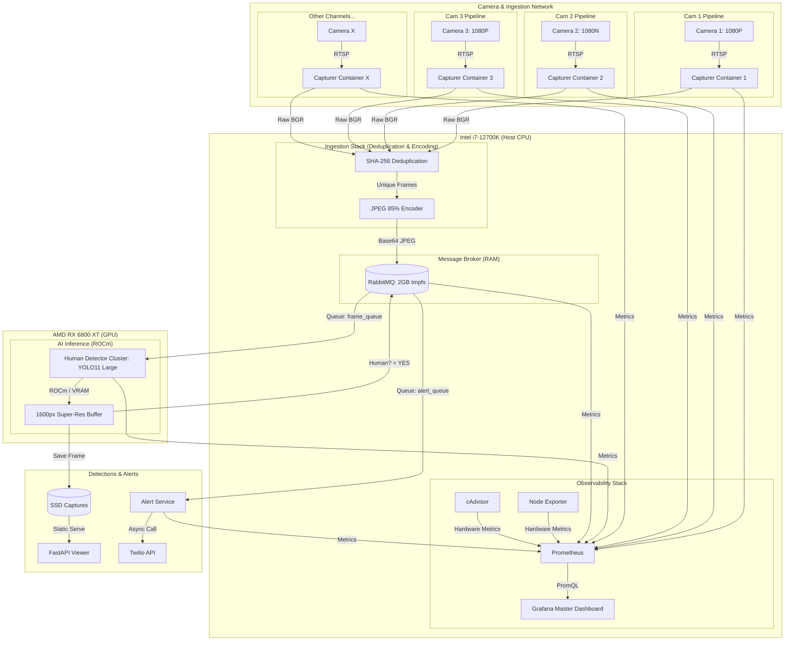

# IntruderWatch | Ultra-High Performance AI Security

[](https://www.gnu.org/licenses/agpl-3.0)

IntruderWatch is an industry-grade
, real-time intruder detection system optimized for high-end hardware (**Intel i7-12700K & AMD RX 6800 XT**). It leverages **YOLO11 Large** for surgical detection precision and **AMD ROCm** for high-speed GPU acceleration.

## 🏗️ System Architecture



## 🚀 Key Features (Ultra Quality Mode)

- **AI Brain**: Upgraded to **YOLO11 Large (v11l)** for maximum accuracy and near-zero false positives.
- **Hardware Accelerated**: Full **AMD GPU acceleration** via ROCm, enabling real-time 1600px inference.
- **High-Fidelity Source**: Captures at **1080P (1920x1080)** and processes at **1600px** AI vision.
- **Motion Precision**: **6 FPS** capture rate (configurable) for smooth movement tracking.
- **Optimized Bandwidth**: Switched from large PNGs to high-quality **JPEG (85%)** for 90% faster transmission.
- **Master Command Center**: Industry-standard **Grafana dashboard** with hardware USE metrics and service RED metrics.

---

## 📂 Repository Structure

**Microservices** (Current):
- `microservices/frame_capturer/` - 1080P/6FPS RTSP capture via ffmpeg.
- `microservices/human_detector/` - GPU-accelerated YOLO11L detection @ 1600px.
- `microservices/alert_service/` - Async Twilio notification engine.
- `microservices/viewer_service/` - FastAPI web UI for browsing high-res detections.
- `microservices/grafana/` & `prometheus/` - 'Master Command Center' observability suite.

**Legacy**:
- `monolith/` - Reference single-container detector (MobileNet-SSD).

---

## 🖥️ System Observability

The system includes a professional-grade monitoring stack accessible at **http://localhost:3000** (admin/admin).

- **Hardware USE**: Real-time Host CPU load, GPU % (AI Core), RAM %, and VRAM usage.
- **AI Analytics**: Per-camera Inference Latency (ms), Throughput (FPS), and Security Stats.
- **Micro-Management**: Per-service RAM/CPU consumption for all security containers.

---

## 🛠️ Configuration (Recommended)

### Hardware Reference
The current deployment is tuned for:
- **CPU**: Intel i7-12700K (12 Cores / 20 Threads)
- **GPU**: AMD Radeon RX 6800 XT (16GB VRAM)
- **RAM**: 32GB DDR4

### Environment Variables (.env)
- `STREAM_IP`, `STREAM_USERNAME`, `STREAM_PASSWORD` - Camera credentials.
- `INFERENCE_SIZE` - AI Vision resolution (Default: **1600**).
- `DETECTION_CONFIDENCE` - AI threshold (Default: **0.8**).
- `FRAME_WIDTH`, `FRAME_HEIGHT` - Capture resolution (Default: **1920x1080**).
- `JPEG_QUALITY` - Image compression (Default: **85**).
- `ALERT_COOLDOWN` - Cooldown between notifications (Default: **90s**).

---

## 🐳 Quick Start (Microservices)

1. **Setup Hardware Drivers**: Ensure AMD ROCm drivers are installed on the host.
2. **Configure**:
   ```bash
   cd microservices
   cp .env.example .env
   # Edit .env with your camera and Twilio details
   ```
3. **Launch**:
   ```bash
   docker compose up -d --build
   ```
4. **Monitor**:
   - Open **Grafana**: http://localhost:3000
   - Open **Viewer**: http://localhost:8085

---

## 💎 Optimization Highlights

- **Multi-Stage Builds**: Docker images are built in stages to ensure the final runtime is lean and secure.
- **Non-Root Execution**: All services run as a dedicated `appuser` for improved security.
- **Aggressive Caching**: Model weights (`yolo11l.pt`) are pre-downloaded during build to ensure instant startups.
- **Resource Caps**: Precise CPU/RAM limits ensure the system stays stable without starving the host OS.

---
