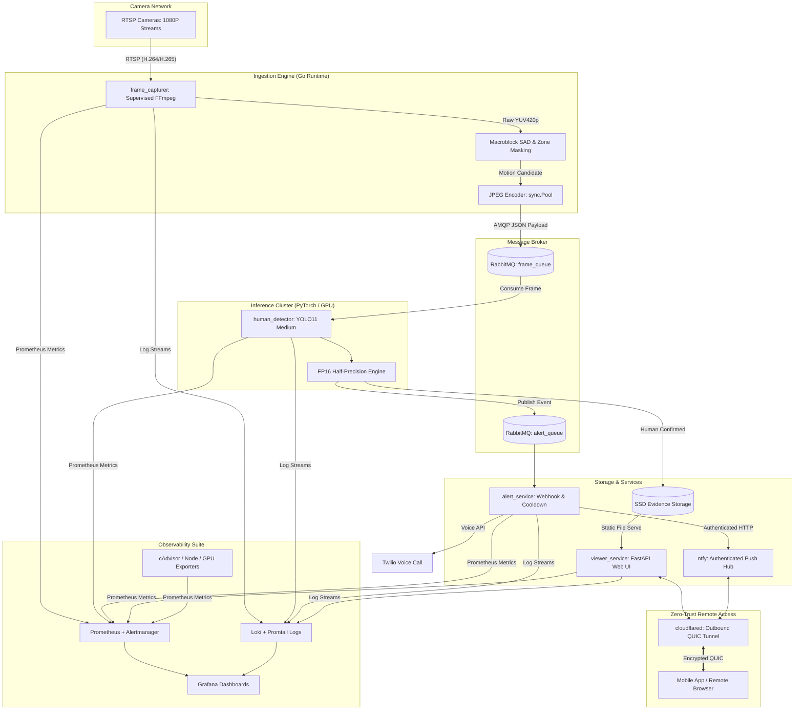

# IntruderWatch

> Real-time, event-driven computer vision surveillance pipeline for multi-camera RTSP networks.

[](https://www.gnu.org/licenses/agpl-3.0)
[](https://github.com/Tahsib/IntruderWatch/actions/workflows/ci.yml)
[](https://github.com/Tahsib/IntruderWatch/actions/workflows/codeql.yml)
[](https://golang.org)
[](https://python.org)
[](https://docs.docker.com/compose/)

---

## Overview

Continuous deep-learning inference across multiple high-definition RTSP streams quickly exhausts hardware compute, elevates thermal footprints, and produces false alarms from night sensor grain and ambient lighting fluctuations.

**IntruderWatch** addresses this by decoupling stream ingestion from neural network inference through an asynchronous, event-driven microservices architecture:

1. **Low-Overhead Ingestion & Motion Gating (Go):** A compiled, zero-allocation Go service interfaces directly with RTSP streams over FFmpeg pipes in raw YUV420p format. It evaluates motion across the full 1080p frame using a spatial $32 \times 32$ macroblock Sum of Absolute Differences (SAD) engine in under 2 ms per frame. Static scenes, global lighting shifts, and pre-configured exclusion zones (such as DVR timestamp clocks) are discarded before any data reaches Python or the GPU.
2. **Message Bus (RabbitMQ):** Only verified motion candidates and temporal post-roll frames are published to an AMQP message queue.
3. **Targeted Inference (GPU / PyTorch):** A decoupled inference cluster consumes candidate frames and executes human detection using **YOLO11 Medium** at FP16 half-precision, supporting both AMD ROCm and NVIDIA CUDA backends.
4. **Multi-Channel Alerting (Twilio & ntfy):** Verified detections trigger automated voice calls via Twilio and high-priority, authenticated push notifications with attached snapshot images via a self-hosted **ntfy** instance. Per-camera cooldown timers prevent alert fatigue.
5. **Auditing & Observability:** Historical captures are indexed in an authenticated web viewer with calendar navigation and date filtering. The entire pipeline exports Prometheus RED metrics to a comprehensive Grafana dashboard.

---

## System Architecture


```mermaid
graph TD
    subgraph "Camera Network"
        CAM[RTSP Cameras: 1080P Streams]
    end

    subgraph "Ingestion Engine (Go Runtime)"
        FC[frame_capturer: Supervised FFmpeg]
        MB[Macroblock SAD & Zone Masking]
        ENC[JPEG Encoder: sync.Pool]
    end

    subgraph "Message Broker"
        RMQ_F[(RabbitMQ: frame_queue)]
        RMQ_A[(RabbitMQ: alert_queue)]
    end

    subgraph "Inference Cluster (PyTorch / GPU)"
        DET[human_detector: YOLO11 Medium]
        FP16[FP16 Half-Precision Engine]
    end

    subgraph "Storage & Services"
        DISK[(SSD Evidence Storage)]
        VIEW[viewer_service: FastAPI Web UI]
        NTFY[ntfy: Authenticated Push Hub]
        ALRT[alert_service: Webhook & Cooldown]
    end

    subgraph "Zero-Trust Remote Access"
        TUNNEL[cloudflared: Outbound QUIC Tunnel]
        CLIENT[Mobile App / Remote Browser]
    end

    subgraph "Observability Suite"
        PROM[Prometheus + Alertmanager]
        GRAF[Grafana Dashboards]
        LOKI[Loki + Promtail Logs]
        EXP[cAdvisor / Node / GPU Exporters]
    end

    %% Pipeline Data Flow
    CAM -- "RTSP (H.264/H.265)" --> FC
    FC -- "Raw YUV420p" --> MB
    MB -- "Motion Candidate" --> ENC
    ENC -- "AMQP JSON Payload" --> RMQ_F

    %% Detection Flow
    RMQ_F -- "Consume Frame" --> DET
    DET --> FP16
    FP16 -- "Human Confirmed" --> DISK
    FP16 -- "Publish Event" --> RMQ_A

    %% Alerting Flow
    RMQ_A --> ALRT
    ALRT -- "Authenticated HTTP" --> NTFY
    ALRT -- "Voice API" --> TWILIO[Twilio Voice Call]

    %% Review & Remote Access Flow
    DISK -- "Static File Serve" --> VIEW
    VIEW & NTFY <--> TUNNEL
    TUNNEL <== "Encrypted QUIC" ==> CLIENT

    %% Telemetry Flow
    FC & DET & ALRT & VIEW & EXP -- "Prometheus Metrics" --> PROM
    FC & DET & ALRT & VIEW -- "Log Streams" --> LOKI
    PROM & LOKI --> GRAF
```

---

## Microservices Catalog

| Service | Runtime | Base Image | Role | Health & Endpoints |
|---|---|---|---|---|
| **`frame_capturer`** | Go 1.22+ | `alpine:3.20` | RTSP ingestion, $32 \times 32$ macroblock SAD motion detection, exclusion masking, live snapshot server | `:8001/healthz`, `:8001/metrics`, `:8001/snapshot` |
| **`human_detector`** | Python 3.10 | `rocm/pytorch` / `nvidia/cuda` | YOLO11 Medium inference, FP16 execution, capture disk persistence | `:8000/metrics` |
| **`alert_service`** | Python 3.12 | `python:3.12-slim` | Multi-channel alert dispatch (Twilio calls + ntfy push), Alertmanager webhook beautifier, per-camera cooldowns | `:8002/healthz`, `:8002/metrics`, `:8002/alerts` |
| **`viewer_service`** | Python 3.12 / FastAPI | `python:3.12-slim` | Responsive web dashboard for security review, cookie session authentication, date navigation | `:8080/health`, `:8080` (HTTP) |
| **`ntfy`** | Go (Static) | `binwiederhier/ntfy` | Self-hosted push notification broker with declarative user provisioning and least-privilege ACLs | `:80/v1/health`, `:80` (HTTP) |
| **`tunnel`** | Go (Static) | `cloudflare/cloudflared` | Outbound QUIC tunnel providing encrypted external access without open inbound router ports | Outbound UDP/QUIC |
| **Observability** | Multi | Prometheus / Grafana / Loki | Real-time hardware telemetry, RED metrics, alert evaluation, and log indexing | Grafana `:3000`, Prometheus `:9090` |

---

## Hardware & Acceleration Backends

IntruderWatch is engineered to scale across diverse hardware configurations:

- **GPU Acceleration:**
  - **AMD ROCm:** Tested on RDNA2 (`gfx1030`) and RDNA3 architectures using the official `rocm/pytorch` runtime.
  - **NVIDIA CUDA:** Compatible with standard PyTorch CUDA containers by updating the `human_detector/Dockerfile` base image.
  - **CPU Mode:** Supported for testing or low-throughput environments.
- **CPU Video Ingestion:**
  - The Go ingestion engine leverages standard POSIX pipes and SIMD-friendly byte loops, consuming **~80 MB RAM per 1080p camera stream** (~74% lower memory footprint compared to Python/OpenCV ingestion).

---

## Getting Started

### Prerequisites

- **Docker:** Engine version 24.0+ and Docker Compose v2.20+
- **Host GPU Drivers:** AMD ROCm or NVIDIA CUDA drivers installed on the host machine
- **Cameras:** RTSP-accessible IP cameras or NVR/DVR supporting H.264/H.265 streams

### Installation

1. **Clone the repository:**
   ```bash
   git clone https://github.com/Tahsib/IntruderWatch.git
   cd IntruderWatch
   ```

2. **Configure environment variables:**
   ```bash
   cp microservices/.env.example microservices/.env
   ```
   Open `microservices/.env` and update the core parameters:
   - Camera RTSP credentials (`STREAM_IP`, `STREAM_USERNAME`, `STREAM_PASSWORD`).
   - Active camera profiles via `COMPOSE_PROFILES` (e.g., `COMPOSE_PROFILES=cam1,cam2,cam3`).
   - Viewer authentication credentials (`VIEWER_USERNAME`, `VIEWER_PASSWORD`).
   - Push notification settings (`NTFY_ADMIN_PASSWORD`, `NTFY_ALERT_SERVICE_PASSWORD`).
   - (Optional) Twilio API keys if voice call alerts are desired.

3. **Start the stack:**
   ```bash
   cd microservices
   docker compose up -d --build
   ```

4. **Verify container health:**
   ```bash
   docker compose ps
   ```
   All active containers should display status `Up (healthy)`.

---

## Service Endpoints

Once deployed, the following local services are available:

| Interface | URL | Default Credentials | Description |
|---|---|---|---|
| **Viewer Web UI** | `http://localhost:8085` | Configured in `.env` | Historical capture browsing and live camera snapshots |
| **ntfy Push Hub** | `http://localhost:8081` | Configured in `.env` | Web and mobile push notification management |
| **Grafana Command Center** | `http://localhost:3000` | `admin` / `admin` | Comprehensive pipeline and hardware telemetry |
| **Prometheus** | `http://localhost:9090` | None | Raw metrics scraping and Alertmanager rules |
| **RabbitMQ Management** | `http://localhost:15672` | Configured in `.env` | AMQP queue depth and message broker throughput |

---

## Configuration Reference

Key environment variables configurable in `microservices/.env`:

### Ingestion Engine (`frame_capturer`)

| Variable | Type | Default | Description |
|---|---|---|---|
| `STREAM_IP` | string | `192.168.1.100` | Target camera or NVR/DVR IP address |
| `STREAM_USERNAME` | string | `admin` | RTSP stream authentication username |
| `STREAM_PASSWORD` | string | `password` | RTSP stream authentication password |
| `FPS` | int | `3` | Frame ingestion rate per camera |
| `FRAME_WIDTH` | int | `1920` | Capture resolution width |
| `FRAME_HEIGHT` | int | `1080` | Capture resolution height |
| `BLOCK_SIZE` | int | `32` | Spatial macroblock dimension in pixels ($32 \times 32$) |
| `MOTION_THRESHOLD` | float | `8.0` | Macroblock mean absolute difference (MAD) sensitivity threshold |
| `MIN_ACTIVE_BLOCKS` | int | `3` | Minimum active blocks required to trigger motion |
| `LIGHTING_SHIFT_RATIO` | float | `0.75` | Active block ratio that triggers ambient lighting shift suppression |
| `EXCLUDE_ZONES` | string | `top-right-clock` | Semicolon-delimited list of exclusion zones or presets (`top-left-clock`, `top-right-clock`, `bottom-left-clock`, `bottom-right-clock`, or `x1,y1,x2,y2`) |
| `POST_ROLL_SECONDS` | float | `1.5` | Duration to keep publishing after motion ceases |
| `START_TIME` | string | `00:00:00` | Daily monitoring schedule start (format: `HH:MM:SS`) |
| `END_TIME` | string | `23:59:59` | Daily monitoring schedule end (supports overnight spans) |

### Detection Cluster (`human_detector`)

| Variable | Type | Default | Description |
|---|---|---|---|
| `YOLO_MODEL` | string | `yolo11m.pt` | Model weights checkpoint (`yolo11n`, `yolo11s`, `yolo11m`, `yolo11l`) |
| `INFERENCE_SIZE` | int | `1280` | Image dimension fed into neural network inference |
| `DETECTION_CONFIDENCE` | float | `0.80` | Minimum confidence score to confirm human presence |
| `SAVE_QUALITY` | int | `85` | JPEG quality level for persisted evidence captures |

### Alert Service (`alert_service`)

| Variable | Type | Default | Description |
|---|---|---|---|
| `ALERT_COOLDOWN` | int | `60` | Cooldown period in seconds between repeated alerts per camera |
| `ENABLE_CALL_ALERTS` | bool | `false` | Enable automated telephone calls via Twilio Voice API |
| `TWILIO_ACCOUNT_SID` | string | - | Twilio Account SID |
| `TWILIO_AUTH_TOKEN` | string | - | Twilio Auth Token |
| `ALERT_PHONE_NUMBERS` | string | - | Destination phone numbers for call alerts |

---

## Observability & Metrics

Every microservice exposes standardized Prometheus metrics scraped every 15 seconds:

- **Ingestion Metrics:**
  - `frame_capturer_captured_total`: Total raw video frames ingested.
  - `frame_capturer_sent_total`: Frames passing motion filtering dispatched to RabbitMQ.
  - `frame_capturer_skipped_total`: Frames discarded by reason (`duplicate`, `rate_limit`, `lighting_shift`, `backpressure`).
  - `frame_capturer_active_motion_blocks`: Real-time gauge of active macroblocks.
  - `frame_capturer_motion_analysis_seconds`: Histogram of spatial motion detection execution time (typically $\le 2\text{ ms}$).
- **Inference Metrics:**
  - `human_detector_frames_processed_total`: Aggregate frames evaluated by the neural network.
  - `human_detector_humans_detected_total`: Total human detection events confirmed.
  - `human_detector_processing_seconds`: Neural network inference latency per frame.
- **Hardware Telemetry:**
  - Real-time GPU junction temperature, power consumption (Watts), core clocks, and VRAM utilization via `amd_gpu_exporter` or `nvidia_gpu_exporter`.
  - Host CPU load, disk I/O, and memory pressure via `node_exporter` and `cAdvisor`.

---

## Security Posture

- **Non-Root Execution:** All services execute under dedicated unprivileged system users (`appuser`, UID `1000`).
- **Least Privilege Access Control:** `ntfy` enforces `auth-default-access: deny-all`. Internal microservices hold write-only permissions on notification topics, while administrators maintain read-write credentials.
- **Zero Inbound Port Forwarding:** Optional integration with Cloudflare Tunnel (`cloudflared`) facilitates secure remote access over encrypted outbound QUIC connections without opening router ports or exposing home IP addresses.
- **Session Authentication:** The viewer service uses HTTP-only session cookies with secure same-site controls and optional bypass tokens for direct mobile image viewing.

---

## License

This project is licensed under the **GNU Affero General Public License v3.0 (AGPLv3)**. See the [LICENSE](LICENSE) file for details.
