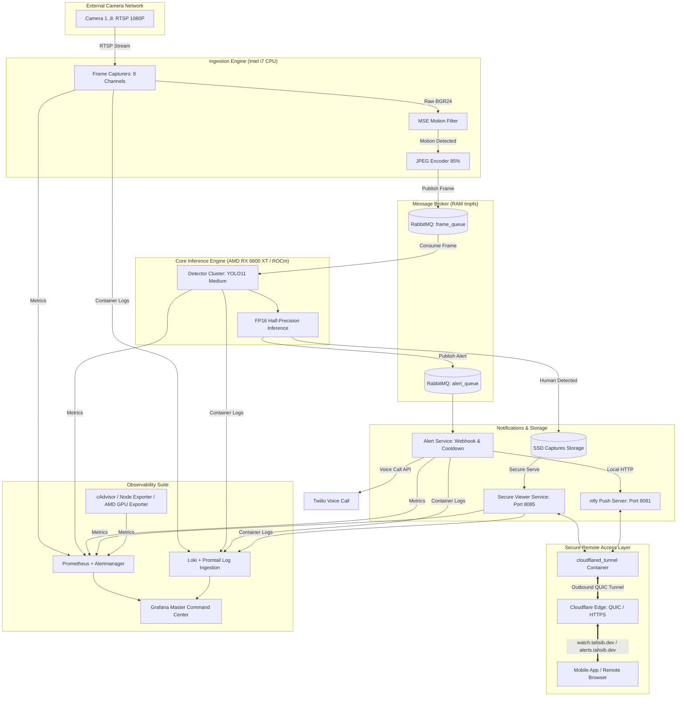

# IntruderWatch Microservices Architecture

## Overview

IntruderWatch is a high-performance intruder detection system designed as a distributed set of microservices orchestrated via RabbitMQ. It captures high-fidelity frames from RTSP security cameras, performs surgical human detection using GPU-accelerated **YOLO11 Medium**, dispatches multi-channel alerts (Twilio + ntfy), and provides a secure web-based interface for visual audit.

The architecture is engineered for high-end hardware, leveraging an **Intel i7-12700K** for ingestion and an **AMD RX 6800 XT** (via ROCm) for real-time detection inference.

---

## Service Catalog

### 1. Ingestion Engine (`frame_capturer/`)

**Purpose:** Establishes high-resolution camera links and standardizes frame data for downstream processing.

**Mechanism:**
- Utilizes `ffmpeg` to interface with RTSP streams.
- Extracts raw BGR24 frames at **3 FPS** (configurable), striking a balance between detection accuracy and thermal safety.
- Performs **MSE-based Motion Filtering** to eliminate redundant processing of static frames (ignoring sensor grain/noise).
- Encodes standardized frames as high-quality **JPEG (85%)**, significantly reducing broker bandwidth while maintaining evidence-grade detail.

**Primary Configuration:**
| Variable | Description | Default |
|---|---|---|
| `STREAM_IP` | Camera/NVR Network Address | `192.168.50.88` |
| `CHANNEL` | Stream Channel Identifier | `1..8` |
| `FPS` | Targeted Frame Rate | `3` |
| `FRAME_WIDTH` | Capture Resolution (Width) | `1920 (1080P)` |
| `FRAME_HEIGHT` | Capture Resolution (Height) | `1080 (1080P)` |
| `JPEG_QUALITY` | Encoder Quality Profile | `85` |
| `MOTION_THRESHOLD` | Sensitivity for MSE Filtering | `5.0` |

---

### 2. Core Inference Engine (`human_detector/`)

**Purpose:** Executes deep learning-based object detection on high-resolution frame buffers.

**Mechanism:**
- Deploys the **YOLO11 Medium** model, optimized for a perfect balance of speed and thermal efficiency.
- Leverages **AMD ROCm** hardware acceleration on the RX 6800 XT.
- Employs **FP16 (Half-Precision)** math to double inference throughput and reduce VRAM bandwidth pressure.
- Implements **Serialized GPU Warm-up** to ensure driver stability during multi-replica initialization.
- **Decision Logic:**
  - Performs spatial detection for human classes.
  - Persists annotated evidence frames to secure storage.
  - Publishes detection events to the notification exchange.

**Hardware Specifications:**
- **Inference Resolution**: 1280px (Standardized high-fidelity input).
- **Math Precision**: FP16 (Half-precision).
- **Concurrency**: 2 Replicas (Optimized for thermal stability and high-end gaming headroom).
- **Memory Profile**: 6GB RAM per replica.

---

### 3. Notification Engine (`alert_service/`)

**Purpose:** Manages asynchronous delivery of security alerts across multiple urgent and visual channels.

**Mechanism:**
- Consumes events from the centralized RabbitMQ alert exchange.
- **Redundant Dispatch:**
  - **Urgent:** Triggers async phone calls via Twilio API.
  - **Visual:** Delivers high-res detection images via self-hosted **ntfy** topics.
- **Suppression Logic:** Enforces a **60s global cooldown** to prevent notification fatigue during ongoing incidents.
- **Alert Beautifier Webhook:** Receives infrastructure and hardware alerts from Prometheus Alertmanager and formats clean, human-readable push notifications to `ntfy`.

---

### 4. Secure Viewer Service (`viewer_service/`)

**Purpose:** Provides a centralized, authenticated interface for historical evidence review.

**Mechanism:**
- FastAPI-based web application with high-performance static serving.
- Implements a **Dual-Layer Authentication** model:
  - **Dashboard:** HTTP Basic Auth.
  - **Instant Alerts:** Secure Bypass Tokens for seamless mobile image preview.

---

### 5. Secure Remote Access (`cloudflared_tunnel`)

**Purpose:** Provides encrypted, zero-trust remote access to camera feeds and notifications without opening inbound firewall ports.

**Mechanism:**
- Runs the lightweight official `cloudflare/cloudflared` daemon.
- Establishes persistent, multiplexed **outbound QUIC (HTTP/3 over UDP)** connections to Cloudflare Edge servers.
- Remotely routes traffic for `watch.tahsib.dev` $\to$ `viewer_service:8080` and `alerts.tahsib.dev` $\to$ `ntfy:80`.
- Eliminates the need for dynamic DNS, open router ports, or manual SSL certificate renewals.

---

### 6. Observability Suite (Master Command Center)

**Purpose:** Delivers real-time operational visibility into system performance, container logs, and hardware health.

**Components:**
- **Prometheus**: Aggregates RED (Rate, Errors, Duration) metrics from all microservices.
- **Alertmanager**: Evaluates threshold rules and routes proactive alerts to the alert service webhook.
- **Loki & Promtail**: Centrally collects, indexes, and streams Docker container logs.
- **AMD GPU Exporter**: Monitors RX 6800 XT Core frequency, **Junction Temperature**, and **Power Draw (Watts)**.
- **cAdvisor**: Provides granular container-level CPU/memory utilization and throttling metrics.
- **Node Exporter**: Tracks host-level hardware telemetry.
- **Grafana**: Orchestrates metrics and logs into the **Master Command Center** dashboard with real-time status panels.

**Key Performance Indicators (KPIs):**
- **Inference Latency**: Milliseconds per detection cycle.
- **Ingestion Throughput**: Aggregate FPS across the camera network.
- **Hardware Saturation**: USE (Utilization, Saturation, Errors) metrics for CPU, GPU, and RAM.
- **Thermal Footprint**: Real-time junction temperature tracking to ensure long-term hardware health.

---

## Operational Excellence

### Production Integrity
- **Stateless Scaling**: Detectors can be scaled horizontally without data loss.
- **Persistence Layer**: Dedicated Docker volumes for logs, metrics, and captures ensure data integrity across reboots.
- **Security Posture**: Non-root execution environments, isolated bridge networks, and Zero-Trust remote access.
